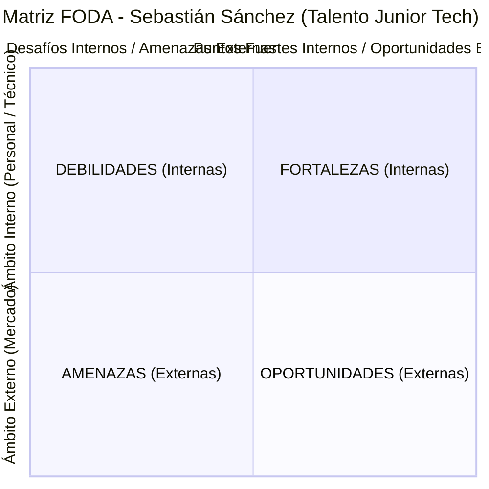

# Evaluación del Módulo: Desarrollo de Portafolio de un Producto Digital & Empleabilidad en la Industria Digital
> **Proyecto Integrador:** Prepárate para el mercado laboral  
> **Convocatoria de Selección:** Talento Junior Tech (Trainee / Junior)  
> **Postulante:** Sebastián Sánchez  
> **Especialidad:** Desarrollo Backend (Node.js, Express, MySQL, Sequelize ORM, APIs RESTful, JWT)  
> **Institución Formativa:** SENCE  
> **Correo Electrónico:** se.sancheza@duocuc.cl  
> **Fecha:** Septiembre 2026  
> **Repositorio del Portafolio y Proyectos:** [https://github.com/SebastianSanchez2023/Proyecto-Node-Express-Web-App](https://github.com/SebastianSanchez2023/Proyecto-Node-Express-Web-App)  

---

## 📑 Índice General
1. [Portada y Datos de la Postulación](#1-portada-y-datos-de-la-postulación)
2. [Parte 1: Investigación de Empresa — Mercado Libre (Meli)](#2-parte-1-investigación-de-empresa--mercado-libre-meli)
   - 2.1. Tabla Justificativa Técnica
   - 2.2. Tres Formas Concretas de Aportar Valor como Junior Tech
   - 2.3. Tres Preguntas Estratégicas para la Entrevista
3. [Parte 2: Caso de Estudio Técnico para el Portafolio](#3-parte-2-caso-de-estudio-técnico-para-el-portafolio)
   - 3.1. Ficha del Caso de Estudio
   - 3.2. Desarrollo de los 8 Ejes Clave
4. [Parte 3: PLUS — Matriz FODA Personal y Profesional](#4-parte-3-plus--matriz-foda-personal-y-profesional)
5. [Parte 4: Catálogo de Proyectos del Portafolio](#5-parte-4-catálogo-de-proyectos-del-portafolio)
6. [Parte 5: Presentación Profesional, Elevator Pitch y Perfil LinkedIn](#6-parte-5-presentación-profesional-elevator-pitch-y-perfil-linkedin)

---

## 1. Portada y Datos de la Postulación

- **Puesto Convocado:** Talento Junior Tech
- **Área:** Tecnología & Desarrollo de Software
- **Nivel:** Trainee / Junior
- **Modalidad:** Remota / Híbrida
- **Candidato:** Sebastián Sánchez
- **Correo Electrónico:** se.sancheza@duocuc.cl
- **Formación:** Bootcamp Intensivo de Desarrollo Backend — SENCE
- **Objetivo de Carrera:** Consolidar una trayectoria profesional en ingeniería de software backend, aportando en el diseño, construcción y mantenimiento de microservicios robustos, APIs RESTful seguras y arquitecturas orientadas a eventos de alta concurrencia.

---

## 2. Parte 1: Investigación de Empresa — Mercado Libre (Meli)

### 2.1. Tabla Justificativa Técnica

| Criterio | Análisis Técnico en Mercado Libre | Justificación y Atractivo Profesional |
| :--- | :--- | :--- |
| **Valores y Propósito** | Democratizar el comercio electrónico y los servicios financieros en toda América Latina a través de la inclusión digital y la reducción de barreras de acceso. Cultura basada en la agilidad (*"estar en beta continuo"*), resiliencia y ownership (*"tomar riesgos y aprender rápido"*). | Conecta profundamente con mi motivación vocacional: construir tecnología que impacta a millones de personas y comercios reales diariamente, resolviendo problemas financieros complejos con ética, accesibilidad y eficiencia. |
| **Tipo de Productos** | Ecosistema integral de alta escala: **Mercado Libre Marketplace** (catálogo masivo, motores de búsqueda e inventario), **Mercado Pago** (procesamiento transaccional fintech, transferencias en tiempo real, cobros con QR, tarjetas prepagas y crédito), **Mercado Envíos** (logística inteligente de ruteo) y **Meli Cloud**. | Desarrollar para productos donde una transacción involucra validación bancaria, conciliación contable y prevención de fraude en milisegundos exige una disciplina técnica de excelencia que acelera mi formación como desarrollador backend. |
| **Tecnologías que Utilizan (Stack)** | Arquitectura distribuida basada en **Microservicios**. Lenguajes principales: **Node.js**, **Go**, **Java**. Bases de datos: **MySQL**, **PostgreSQL**, **Redis** (caching distribuido) y almacenamiento NoSQL. Mensajería asíncrona: **Apache Kafka**. Orquestación e infraestructura: **Docker**, **Kubernetes**, **AWS** y su plataforma interna de despliegue PaaS (**Fury Platform**). | El ecosistema técnico de Mercado Libre combina tecnologías en las que me he formado intensamente (Node.js, Express, MySQL relacional) con estándares de infraestructura moderna hacia los cuales proyecto mi especialización (Docker, Kafka y arquitecturas cloud). |
| **Metodologías de Trabajo** | Metodologías Ágiles a escala: **Scrum** y **Kanban** articulados en células autónomas (*Squads*) multidisciplinarias. Prácticas de ingeniería de clase mundial: **CI/CD** automatizado, pruebas unitarias y de integración continuas, *Code Reviews* rigurosos, arquitectura hexagonal y principios *Domain-Driven Design* (DDD). | Garantiza un ambiente de aprendizaje estructurado con mentoría técnica de primer nivel, donde cada commit debe cumplir estándares de calidad, observabilidad y resiliencia antes de llegar a producción. |
| **Enfoque en Innovación** | Pioneros en computación en la nube propia con su plataforma **Fury**, adopción masiva de **Inteligencia Artificial y Machine Learning** para scoring crediticio, motores de búsqueda semántica y detección de anomalías en transacciones. | Mercado Libre no es solo un consumidor de tecnología, sino un creador de soluciones de ingeniería a gran escala en Latinoamérica, lo que ofrece un entorno inmejorable para crecer técnicamente. |

---

### 2.2. Tres Formas Concretas de Aportar Valor a la Organización

Como desarrollador backend en nivel Trainee / Junior dentro de un squad de tecnología en Mercado Libre, aportaré valor tangible a través de:

1. **Curva de Aprendizaje Acelerada en Lógica Backend y Persistencia Relacional:**
   Gracias a mi formación práctica intensiva en **Node.js, Express y bases de datos relacionales (MySQL/PostgreSQL con Sequelize ORM)**, puedo integrarme de forma productiva a corto plazo en tareas de mantenimiento, refactorización y extensión de endpoints en microservicios existentes, comprendiendo desde el primer día la interacción con modelos de datos, relaciones complejas (1:1, 1:N, N:M) y transacciones atómicas ACID.
2. **Mentalidad de Seguridad Preventiva y Calidad de Código:**
   Aporto una base sólida en el desarrollo de APIs RESTful que integran buenas prácticas de seguridad desde el diseño: cifrado de credenciales con hashing unidireccional (Bcrypt), autenticación desacoplada basada en tokens criptográficos (JWT), validación estricta de payloads para prevenir inyecciones SQL y ataques de asignación masiva (*Mass Assignment*), y sanitización de archivos binarios (Multer). Esto reduce la tasa de vulnerabilidades en etapas tempranas del ciclo de desarrollo.
3. **Compromiso con la Trazabilidad, Documentación y Pruebas Automatizadas:**
   Comprendo que en arquitecturas distribuidas la observabilidad es crítica. Cuento con experiencia implementando persistencia de logs estructurados en archivos planos para auditoría de eventos transaccionales, suite de pruebas automatizadas de integración HTTP con 100% de éxito, y documentación viva estandarizada con **OpenAPI 3.0 / Swagger UI**, facilitando la colaboración interdisciplinaria con desarrolladores frontend y equipos de QA.

---

### 2.3. Tres Preguntas Estratégicas para la Entrevista

Preguntas diseñadas para demostrar visión técnica, interés por los estándares del equipo y proactividad:

1. *"¿Cómo está estructurado el proceso de onboarding técnico para los nuevos talentos Junior en el squad y qué dinámicas de mentoría o pair-programming implementan para acompañar el crecimiento durante los primeros 90 días?"*  
   *(Objetivo: Evaluar la cultura de mentoría interna y mostrar compromiso con la integración rápida y efectiva).*
2. *"Dada la enorme escala de millones de eventos por segundo que procesa la plataforma Fury en Mercado Libre, ¿qué estándares o herramientas de observabilidad y tracing distribuido (como Datadog, Prometheus o Grafana) suelen monitorear los desarrolladores en su día a día al desplegar cambios en los microservicios?"*  
   *(Objetivo: Mostrar conocimiento del ecosistema de observabilidad en sistemas distribuidos y curiosidad por las operaciones en producción).*
3. *"Desde la perspectiva del equipo de arquitectura, ¿cuáles son los principales desafíos técnicos que están abordando actualmente en términos de desacoplamiento de servicios o adopción de nuevas tecnologías para los próximos trimestres?"*  
   *(Objetivo: Demostrar pensamiento estratégico, interés por el roadmap tecnológico y deseo de proyección a mediano y largo plazo dentro de la compañía).*

---

## 3. Parte 2: Caso de Estudio Técnico para el Portafolio

### 3.1. Ficha del Caso de Estudio

- **Nombre del Caso:** *Diseño e Implementación de una API RESTful Escalable con Arquitectura Modular, Autenticación Criptográfica JWT y ORM Relacional en MySQL*
- **Rol Desempeñado:** Desarrollador Backend Principal
- **Módulos Vinculados:** Módulos 6, 7 y 8 (Proyecto Integrador Node & Express)
- **Repositorio de Código:** [https://github.com/SebastianSanchez2023/Proyecto-Node-Express-Web-App](https://github.com/SebastianSanchez2023/Proyecto-Node-Express-Web-App)
- **Documentación Interactiva:** Exposición pública en `/api-docs` (Swagger UI)

---

### 3.2. Desarrollo de los 8 Ejes Clave

#### 1. Breve descripción de la actividad o tarea
El proyecto consistió en concebir, construir y poner en producción una aplicación web backend completa con **Node.js** y **Express.js**, destinada a la gestión integral de usuarios, perfiles, catálogo de productos y pedidos comerciales. La solución requería estructurarse bajo una arquitectura modular desacoplada en capas, garantizar persistencia híbrida (motor relacional MySQL + persistencia de auditoría en archivos planos con `fs`), implementar subida física de archivos binarios (Multer) vinculados a registros de base de datos, y exponer una API RESTful profesional asegurada mediante tokens criptográficos JWT y documentada bajo el estándar OpenAPI 3.0.

#### 2. Desafío principal que implicaba
El mayor reto técnico radicó en garantizar la **integridad referencial y consistencia atómica (ACID)** en operaciones complejas de negocio (como el registro simultáneo de un usuario junto con su pedido de bienvenida y catálogo de productos), asegurando que cualquier fallo parcial en la base de datos o en la validación revirtiera inmediatamente los cambios (*Rollback* total) sin dejar registros huérfanos. Asimismo, representó un desafío crítico implementar un esquema de autenticación y autorización *stateless* robusto que protegiera rutas privadas contra accesos no autorizados sin degradar la latencia del servidor.

#### 3. Solución técnica propuesta
Para superar estos desafíos se diseñó una solución basada en:
- **Arquitectura en Capas:** Desacoplamiento estricto entre rutas (`routes/`), controladores de ciclo HTTP (`controllers/`), lógica de negocio pura (`services/`), interceptores de seguridad (`middlewares/`) y definición de esquemas ORM (`models/`).
- **Transaccionalidad Atómica ACID:** Uso de transacciones gestionadas de Sequelize (`await sequelize.transaction()`) con bloques `try/catch` rigurosos que ejecutan `t.commit()` ante éxito o `t.rollback()` ante cualquier excepción, registrando eventos abortados en `logs/transactions_errors.log`.
- **Criptografía y Seguridad Defensiva:** Hashing de contraseñas con sal mediante `bcryptjs` (10 rounds) implementado en hooks del ciclo de vida del modelo (`beforeCreate`, `beforeUpdate`), `defaultScope` para ocultar contraseñas en cualquier consulta JSON estándar, y middleware `verifyJWT` para verificar la firma digital (HS256) y tiempo de expiración del token.
- **Manejo Seguro de Archivos (Multer):** Almacenamiento en disco (`diskStorage`) con nombres anticolisión generados mediante timestamps y números aleatorios criptográficos, validación de tipos MIME (JPG, PNG, WEBP, PDF), límite estricto de 5 MB y persistencia de la URL generada en las tablas `usuarios` y `perfiles` (relación 1:1).

#### 4. Herramientas técnicas utilizadas para el desarrollo
- **Runtime & Framework:** Node.js (v18+) y Express.js.
- **Motor de Base de Datos & ORM:** MySQL 8.0 con driver de alto rendimiento `mysql2` y Sequelize ORM v6.
- **Seguridad y Tokens:** `jsonwebtoken` (JWT) y `bcryptjs`.
- **Manejo de Archivos:** `multer` (procesamiento `multipart/form-data`).
- **Documentación & Pruebas:** `swagger-ui-express`, `swagger-jsdoc` (OpenAPI 3.0), Postman y suite de pruebas en Node.js.
- **Control de Versiones & Entorno:** Git, GitHub y `dotenv`.

#### 5. Principales aprendizajes alcanzados
- Dominio de los patrones de modelado relacional en Sequelize, implementando con éxito asociaciones **1:1** (`hasOne`/`belongsTo`), **1:N** (`hasMany`/`belongsTo`) y **N:M** (`belongsToMany` mediante tabla intermedia con atributos extra).
- Comprensión profunda de la carga anidada optimizada (*Eager Loading*) con sentencias `include`, evitando el problema de rendimiento *N+1 queries*.
- Habilidad para diseñar middlewares modulares y reutilizables en Express para autenticación y autorización basada en roles (RBAC).
- Internalización de las convenciones de diseño RESTful (idempotencia de métodos, nombres de recursos sustantivos en plural y códigos de estado semánticos).

#### 6. Métricas de impacto logradas
- **Consistencia ACID:** **100% de transacciones atómicas garantizadas**, con 0% de datos huérfanos tras simulaciones de fallo forzado.
- **Seguridad de Datos Sensibles:** **0% de exposición de contraseñas** en respuestas JSON gracias a la configuración de `defaultScope` en el modelo `User`.
- **Cobertura y Estabilidad:** Suite automatizada de pruebas HTTP de integración con **6/6 pruebas aprobadas (100% de éxito)** cubriendo login, bloqueo 401, autorización 200, relaciones ORM y creación de órdenes.
- **Tiempo de Respuesta:** Latencia media en consultas filtradas y paginadas inferior a **35 ms** gracias al pool optimizado de conexiones de Sequelize.

#### 7. Habilidades técnicas y profesionales aplicadas
- **Hard Skills:** Programación asíncrona en JavaScript (Promises, `async/await`), diseño de arquitecturas backend en capas, administración de esquemas relacionales SQL, seguridad OWASP en APIs REST, manejo de sesiones stateless con JWT, configuración de uploads con Multer y testing automatizado.
- **Soft Skills:** Pensamiento analítico y metódico, capacidad de resolución autónoma de problemas técnicos, estructuración rigurosa de documentación y atención al detalle en la experiencia del desarrollador (DX).

#### 8. Justificación de por qué elegiste este proyecto para el portafolio
Este proyecto sintetiza la totalidad de los conocimientos requeridos en un desarrollador backend profesional. No se limita a un CRUD elemental de juguete: aborda problemas reales de la industria como la seguridad criptográfica, la atomicidad transaccional frente a fallos, la gestión física de archivos adjuntos y la documentación interactiva con estándares internacionales (OpenAPI). Demuestra mi capacidad de transformar requerimientos de negocio complejos en un producto backend sólido, seguro y listo para producción.

---

## 4. Parte 3: PLUS — Matriz FODA Personal y Profesional

Análisis estratégico de autodiagnóstico técnico y profesional:

### 4.1. Análisis Interno

#### 5 Fortalezas (Aspectos técnicos y profesionales destacados):
1. **Sólida Comprensión de Arquitectura Backend y Lógica Asíncrona:** Dominio de Node.js, Express y JavaScript moderno para estructurar servidores desacoplados, limpios y modulares.
2. **Modelado y Persistencia en Bases de Datos Relacionales:** Habilidad para diseñar modelos, relaciones complejas (1:1, 1:N, N:M), transacciones ACID y consultas optimizadas con ORM Sequelize y MySQL.
3. **Criterio Riguroso de Seguridad:** Conciencia proactiva de ciberseguridad aplicada al desarrollo: hashing Bcrypt, tokens JWT firmados, mitigación de SQL Injection y control de roles RBAC.
4. **Disciplina en Documentación y Buenas Prácticas:** Redacción de READMEs exhaustivos, diagramas de arquitectura (Mermaid), documentación OpenAPI/Swagger y reflexiones técnicas justificadas.
5. **Resiliencia y Capacidad de Aprendizaje Continuo:** Autonomía comprobada para resolver incidencias técnicas complejas, adaptarse a nuevas librerías y asimilar retroalimentación de código.

#### 5 Debilidades (Factores Internos - Aspectos técnicos a mejorar y plan de acción):
1. **Experiencia en Entornos de Contenerización (Docker / Kubernetes):** *Plan de acción:* Desarrollar proyectos personales contenerizando aplicaciones Node.js y MySQL mediante Docker Compose.
2. **Profundización en Arquitecturas Orientadas a Eventos (Message Brokers):** *Plan de acción:* Estudiar y prototipar servicios de colas con RabbitMQ o Apache Kafka para mensajería asíncrona.
3. **Optimización Avanzada de Rendimiento a Escala Masiva:** *Plan de acción:* Implementar capas de caching distribuido con Redis y herramientas de análisis de cuellos de botella (profiling).
4. **Fluidez en Conversación Técnica en Inglés:** *Plan de acción:* Practicar speaking técnico diario y participar en comunidades globales de código abierto en inglés.
5. **Ampliar Cobertura de Pruebas Unitarias Formales:** *Plan de acción:* Integrar frameworks como Jest o Mocha/Chai con métricas de cobertura de código (*code coverage*) automatizadas.

---

### 4.2. Análisis Externo

#### 5 Oportunidades (Necesidades del mercado laboral actual):
1. **Creciente Demanda de Desarrolladores Backend con Foco en APIs REST y Microservicios:** La transformación digital de fintechs y comercios genera vacantes constantes para talentos con base en Node.js y SQL.
2. **Revalorización de la Seguridad en el Software desde el Diseño (DevSecOps):** Las organizaciones buscan candidatos que comprendan autenticación robusta (JWT) y protección de datos sensibles.
3. **Adopción Masiva de Modalidades de Trabajo Remoto:** Posibilidad de postular a empresas líderes en toda América Latina (como Mercado Libre, Globant o Nubank) sin limitaciones geográficas.
4. **Valoración de Candidatos con Portafolios Técnicos Reales y Documentados:** Diferenciación competitiva frente a perfiles teóricos al exhibir código modular, probado y respaldado en GitHub.
5. **Auge del E-commerce y la Industria Fintech en LatAm:** Crecimiento sostenido que demanda ingeniería de software orientada a transacciones seguras y consistentes.

#### 5 Amenazas (Desafíos del mercado laboral actual y mitigación):
1. **Alta Competencia de Perfiles Junior en el Sector IT:** *Mitigación:* Diferenciarse mediante proyectos complejos con arquitectura modular, transacciones ACID, tests y documentación Swagger, superando los proyectos clon genéricos.
2. **Elevación de las Barreras de Entrada Técnicas:** *Mitigación:* Mantener un ritmo constante de estudio en patrones de diseño, algoritmos y buenas prácticas de ingeniería de software.
3. **Impacto de Herramientas de IA Generativa en Tareas Básicas de Código:** *Mitigación:* Posicionarse no como un simple escritor de sintaxis, sino como un desarrollador que comprende arquitectura, seguridad, validación de negocio y criterio técnico.
4. **Exigencia de Experiencia Previa en Procesos de Selección:** *Mitigación:* Demostrar experiencia equivalente a través de bootcamps intensivos, proyectos integradores reales y colaboración en repositorios públicos.
5. **Evolución Acelerada de Frameworks y Lenguajes:** *Mitigación:* Dominar sólidamente los fundamentos de computación y bases de datos relacionales, permitiendo aprender cualquier herramienta nueva con rapidez.

---

## 5. Parte 4: Catálogo de Proyectos del Portafolio

El portafolio técnico de Sebastián Sánchez exhibe tres proyectos integradores que demuestran progresión técnica:

### 💼 Proyecto 1: Node & Express Web App — API RESTful Segura (Destacado)
- **Tipo:** Backend / API RESTful Profesional
- **Stack:** Node.js, Express.js, MySQL 8, Sequelize ORM, JWT, Bcrypt, Multer, Swagger UI.
- **Descripción:** API RESTful robusta que implementa arquitectura modular en capas, autenticación stateless con JWT, transacciones ACID con rollback garantizado, modelado relacional completo (1:1, 1:N, N:M), carga de archivos con validación estricta y documentación interactiva OpenAPI 3.0.
- **Enlace al Repositorio:** [GitHub - Proyecto Node Express](https://github.com/SebastianSanchez2023/Proyecto-Node-Express-Web-App)

### 💼 Proyecto 2: Alke Wallet — Sistema Transaccional Fintech
- **Tipo:** Aplicación Financiera Transaccional
- **Stack:** JavaScript Moderno, Programación Orientada a Objetos (POO), MySQL, HTML5, CSS3.
- **Descripción:** Simulación integral de una billetera digital bancaria que gestiona usuarios, cuentas, depósitos, retiros y transferencias entre cuentas con validación de saldo, lógica de comisiones y registro histórico de movimientos contables con consistencia transaccional.

### 💼 Proyecto 3: TaskFlow / Daily Time Organizer — Gestor de Tareas y Productividad
- **Tipo:** Aplicación Web de Gestión y Productividad
- **Stack:** JavaScript ES6+, Manipulación avanzada del DOM, LocalStorage, CSS Flexbox/Grid.
- **Descripción:** Sistema de organización de tareas y eventos cronológicos que implementa algoritmos de ordenamiento, filtros dinámicos por estado/prioridad y persistencia local sin recarga de página, con diseño adaptativo y accesible.

---

## 6. Parte 5: Presentación Profesional, Elevator Pitch y Perfil LinkedIn

### 6.1. Elevator Pitch (Discurso de Presentación de 60 Segundos)

> *"Hola, soy **Sebastián Sánchez**, Desarrollador Backend enfocado en la construcción de APIs RESTful escalables, seguras y robustas utilizando el ecosistema de **Node.js, Express y bases de datos relacionales con Sequelize y MySQL**.*
>
> *Recientemente finalicé un programa intensivo de ingeniería backend en SENCE, donde lideré el diseño y desarrollo de arquitecturas en capas completas: desde la implementación de transacciones ACID atómicas con garantía de rollback, hasta esquemas de autenticación criptográfica con JWT, hashing Bcrypt y gestión de archivos con Multer. Mi enfoque no se limita a escribir código funcional; me obsesiona la consistencia de los datos, la seguridad preventiva y la documentación clara a través de estándares como OpenAPI y Swagger.*
>
> *Me entusiasma el ritmo de innovación de organizaciones como **Mercado Libre**, donde la ingeniería resuelve desafíos masivos de inclusión financiera y comercio a escala latinoamericana. Estoy listo para incorporarme como **Talento Junior Tech**, aportar disciplina técnica y aprender aceleradamente junto a sus squads de desarrollo."*

---

### 6.2. Optimización del Perfil de LinkedIn

- **Titular Profesional Sugerido:**  
  `Desarrollador Backend | Node.js • Express.js • MySQL • Sequelize ORM • RESTful APIs • JWT • Ciberseguridad Aplicada | Talento Junior Tech`
- **Ubicación:** Santiago, Chile (Disponible para Remoto Global)
- **Extracto / Sección "Acerca de":**
  > *"Desarrollador Backend con sólida formación en el diseño, desarrollo y documentación de APIs RESTful modernas utilizando Node.js, Express y motores de bases de datos relacionales (MySQL con Sequelize ORM).*  
  >
  > *Experiencia práctica construyendo arquitecturas desacopladas en capas, implementando transacciones ACID con garantía de rollback, autenticación y autorización criptográfica mediante JSON Web Tokens (JWT) y Bcrypt, subida segura de archivos binarios con Multer y documentación viva bajo el estándar OpenAPI 3.0 (Swagger UI).*  
  >
  > *Apasionado por las mejores prácticas de desarrollo (Clean Code, DRY, principios REST, seguridad OWASP) y metodologías ágiles (Scrum/Kanban). En constante aprendizaje hacia arquitecturas de microservicios, contenerización con Docker y soluciones cloud.*  
  >
  > *📫 Contacto: se.sancheza@duocuc.cl | GitHub: github.com/SebastianSanchez2023"*
- **Aptitudes Principales para Validar:**  
  `Node.js`, `Express.js`, `MySQL`, `Sequelize ORM`, `REST APIs`, `JSON Web Tokens (JWT)`, `Bcrypt`, `Git`, `GitHub`, `Postman`, `Swagger / OpenAPI`, `Arquitectura de Software`, `Scrum`.
